# Enterprise Business Management System for Logistics ABC

A distributed enterprise application for commercial logistics operations: customer master data, contract lifecycle, configurable multi-step approval, pricing versions, operational volumes, billing sheets with immutable price snapshots, asynchronous e-signing, notifications, and immutable audit trails.

This repository is the implementation artefact for the **Distributed Applications (UDPT)** course project. The system is organised as a monorepo of eight FastAPI microservices behind a single API Gateway, a React operator portal, and supporting infrastructure (PostgreSQL, Redis, Kafka, MinIO), provisioned locally with Docker Compose and optionally with Kubernetes manifests.

| Artefact | Location |
|----------|----------|
| Project report | [docs/UDPT-09-Report.pdf](docs/UDPT-09-Report.pdf) |
| Architecture notes | [docs/ARCHITECTURE.md](docs/ARCHITECTURE.md) |
| Service / UC map | [docs/SERVICE_MAP.md](docs/SERVICE_MAP.md) |
| Team ownership | [docs/TEAM_ASSIGNMENT.md](docs/TEAM_ASSIGNMENT.md) |
| Remote repository | [GitHub](https://github.com/TheHien04/Enterprise-Management-System---DISTRIBUTED-APPLICATIONS) |

---

## Contents

1. [Research context](#1-research-context)
2. [Technology stack](#2-technology-stack)
3. [System capabilities](#3-system-capabilities)
4. [Distributed architecture](#4-distributed-architecture)
5. [Communication and consistency model](#5-communication-and-consistency-model)
6. [Operator interface](#6-operator-interface)
7. [Inter-service interaction patterns](#7-inter-service-interaction-patterns)
8. [Team structure](#8-team-structure)
9. [Reproduction](#9-reproduction)
10. [Evaluation scenarios](#10-evaluation-scenarios)
11. [References](#11-references)

---

## 1. Research context

Enterprise logistics platforms require clear service boundaries, reliable cross-cutting concerns (authentication, authorisation, audit), and eventual consistency for side effects such as notifications. This project applies established distributed-systems patterns in a bounded commercial domain (BMS for a fictional Logistics ABC entity operating in a Singapore / ASEAN logistics context):

- **Database-per-service** — each bounded context owns its schema; cross-context joins are forbidden.
- **API Gateway as single entry point** — JWT validation, role-based access control, rate limiting, and idempotency.
- **Config-driven state machines and workflows** — lifecycle transitions and approval chains are declared in JSON rather than hard-coded conditionals.
- **Transactional outbox** — domain events are persisted with business data and relayed to Kafka asynchronously.
- **Synchronous REST** for request/response business orchestration; **asynchronous messaging** for notification and audit fan-out.

The implementation is intentionally a course-scale demonstration: production concerns such as SSO, full TMS/WMS, and multi-region disaster recovery are out of scope.

---

## 2. Technology stack

### 2.1 Layered view

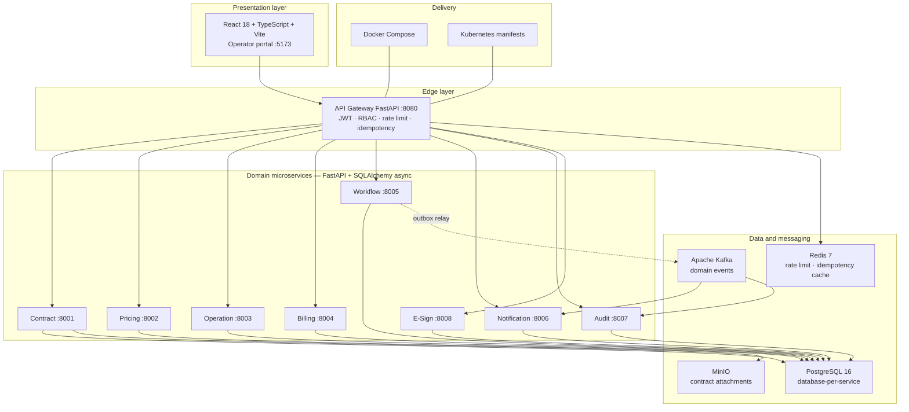
```mermaid
flowchart TB
  subgraph Presentation["Presentation layer"]
    FE["React 18 + TypeScript + Vite<br/>Operator portal :5173"]
  end

  subgraph Edge["Edge layer"]
    GW["API Gateway FastAPI :8080<br/>JWT · RBAC · rate limit · idempotency"]
  end

  subgraph Domain["Domain microservices — FastAPI + SQLAlchemy async"]
    CS["Contract :8001"]
    PS["Pricing :8002"]
    OS["Operation :8003"]
    BS["Billing :8004"]
    WS["Workflow :8005"]
    NS["Notification :8006"]
    AS["Audit :8007"]
    ES["E-Sign :8008"]
  end

  subgraph Data["Data and messaging"]
    PG["PostgreSQL 16<br/>database-per-service"]
    RD["Redis 7<br/>rate limit · idempotency cache"]
    KF["Apache Kafka<br/>domain events"]
    MN["MinIO<br/>contract attachments"]
  end

  subgraph Delivery["Delivery"]
    DC["Docker Compose"]
    K8["Kubernetes manifests"]
  end

  FE --> GW
  GW --> CS & PS & OS & BS & WS & NS & AS & ES
  CS & PS & OS & BS & WS --> PG
  NS & AS & ES --> PG
  GW --> RD
  WS -. outbox relay .-> KF
  KF --> NS & AS
  CS --> MN
  DC --- GW
  K8 --- GW
```

### 2.2 Stack catalogue

| Layer | Technology | Role in the system |
|-------|------------|--------------------|
| Client | React, TypeScript, Vite | Role-based operator UI, i18n (EN/VI), light/dark theme |
| Edge | FastAPI API Gateway | Single public entry; JWT; RBAC; Redis rate limit and idempotency |
| Services | FastAPI, Pydantic, SQLAlchemy (async), httpx | Eight bounded-context APIs |
| Shared library | `udpt_common` | State machine, outbox, auth helpers, Kafka utilities |
| Configuration | JSON (`state_machines`, `workflow_definitions`, `seed_data`) | Declarative lifecycle and approval templates |
| Relational store | PostgreSQL 16 | Six logical databases (`contract_db` … `support_db`) |
| Cache | Redis 7 | Gateway throttling and idempotent response replay |
| Messaging | Kafka (+ ZooKeeper) | Asynchronous notification and audit fan-out |
| Object storage | MinIO | Contract attachment objects |
| Runtime | Docker Compose; optional Kubernetes | Local and cluster deployment |
| Verification | pytest, httpx, SC-01–SC-10 | Integration scenarios against a live stack |

### 2.3 Language and runtime summary

| Area | Choice |
|------|--------|
| Backend language | Python 3.11+ |
| Backend framework | FastAPI (ASGI / Uvicorn) |
| Frontend language | TypeScript |
| Frontend framework | React 18 |
| Build tooling | Vite |
| Inter-service calls | HTTP/REST (sync), Kafka events (async) |
| Auth token | JWT (HS256) issued by the gateway |

---

## 3. System capabilities

| ID | Capability | Status |
|----|------------|--------|
| UC-01 | Enterprise customer management | Implemented |
| UC-02 | Contract lifecycle with five-step approval | Implemented |
| UC-03 | Contract appendices | Implemented |
| UC-04 | Service price lists (overlap detection, supersede) | Implemented |
| UC-05 | Operational volumes and period locking | Implemented |
| UC-06 | Billing sheets with unit-price snapshot | Implemented |
| UC-07 | Configurable workflow engine with user-level assignees | Implemented |
| UC-08 | Asynchronous e-signing with retry | Implemented |
| UC-09 | Event-driven notifications and expiry warnings | Implemented |
| UC-10 | Immutable audit trail, outbox, idempotency, rate limit | Implemented |

Representative business rules exercised by integration scenarios SC-01–SC-10 include attachment-required contract submit (CTR-02), price-list overlap rejection (PRC-03), billing price snapshot immutability (SC-04), concurrent approval conflict (SC-05), and assignee-user enforcement (APR-01 / SC-08).

---

## 4. Distributed architecture

### 4.1 System context

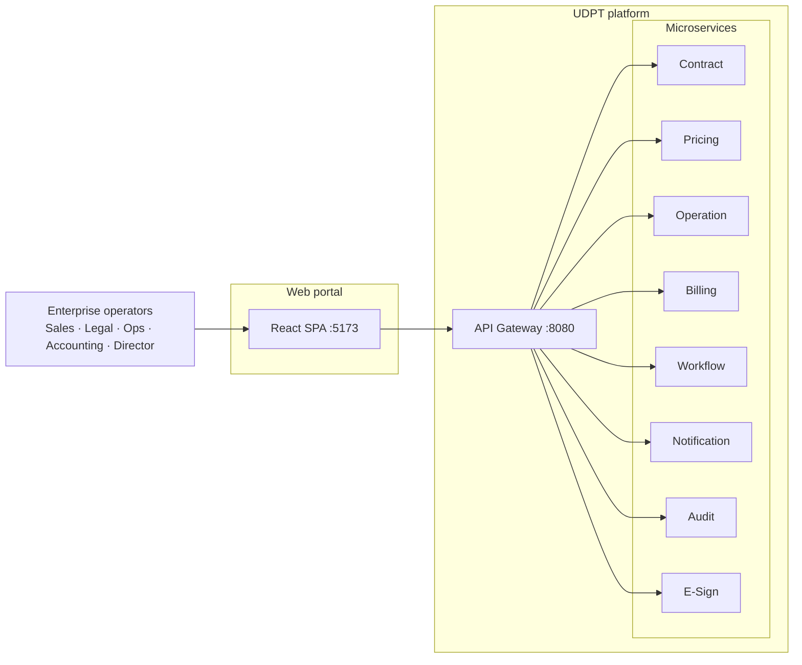
```mermaid
flowchart LR
  U["Enterprise operators<br/>Sales · Legal · Ops · Accounting · Director"]

  subgraph Portal["Web portal"]
    UI["React SPA :5173"]
  end

  subgraph Platform["UDPT platform"]
    GW["API Gateway :8080"]
    subgraph Services["Microservices"]
      C["Contract"]
      P["Pricing"]
      O["Operation"]
      B["Billing"]
      W["Workflow"]
      N["Notification"]
      A["Audit"]
      E["E-Sign"]
    end
  end

  U --> UI --> GW
  GW --> C & P & O & B & W & N & A & E
```

### 4.2 Service topology and persistence

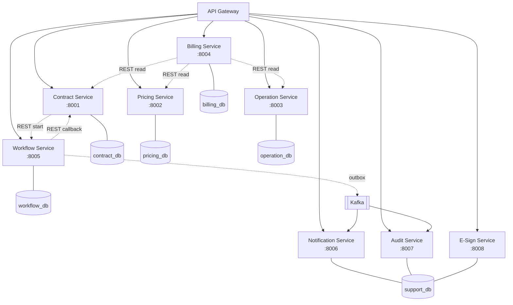
```mermaid
flowchart TB
  GW["API Gateway"]

  GW --> C["Contract Service<br/>:8001"]
  GW --> P["Pricing Service<br/>:8002"]
  GW --> O["Operation Service<br/>:8003"]
  GW --> B["Billing Service<br/>:8004"]
  GW --> W["Workflow Service<br/>:8005"]
  GW --> N["Notification Service<br/>:8006"]
  GW --> A["Audit Service<br/>:8007"]
  GW --> E["E-Sign Service<br/>:8008"]

  C --- CD[(contract_db)]
  P --- PD[(pricing_db)]
  O --- OD[(operation_db)]
  B --- BD[(billing_db)]
  W --- WD[(workflow_db)]
  N --- SD[(support_db)]
  A --- SD
  E --- SD

  C -. REST start .-> W
  W -. REST callback .-> C
  B -. REST read .-> C & P & O
  W -. outbox .-> K[[Kafka]]
  K --> N
  K --> A
```

| Component | Port | Persistence | Responsibility |
|-----------|------|-------------|----------------|
| API Gateway | 8080 | Redis (rate limit, idempotency) | Authentication, authorisation, routing |
| Contract Service | 8001 | `contract_db` | Customers, contracts, appendices, attachments |
| Pricing Service | 8002 | `pricing_db` | Service catalogue and price-list versions |
| Operation Service | 8003 | `operation_db` | Billing periods and volume records |
| Billing Service | 8004 | `billing_db` | Billing sheets, adjustments, price snapshots |
| Workflow Service | 8005 | `workflow_db` | Approval instances, steps, action logs |
| Notification Service | 8006 | `support_db` | User notifications (Kafka consumer) |
| Audit Service | 8007 | `support_db` | Immutable audit logs (Kafka consumer) |
| E-Sign Service | 8008 | `support_db` | Signing sessions and callbacks |

Logical database layout (database-per-service):

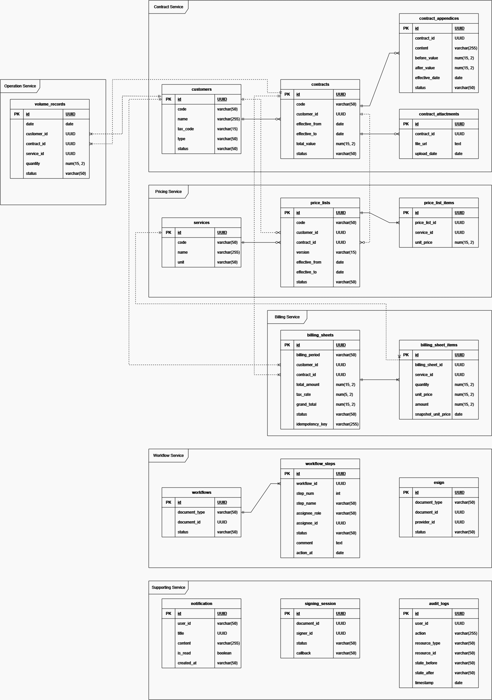

Gateway configuration maps public paths under `/api/v1/{service}/...` to container hostnames such as `http://contract-service:8001`. Browser clients use only `http://localhost:8080`.

### 4.3 Contract approval chain (config-driven)

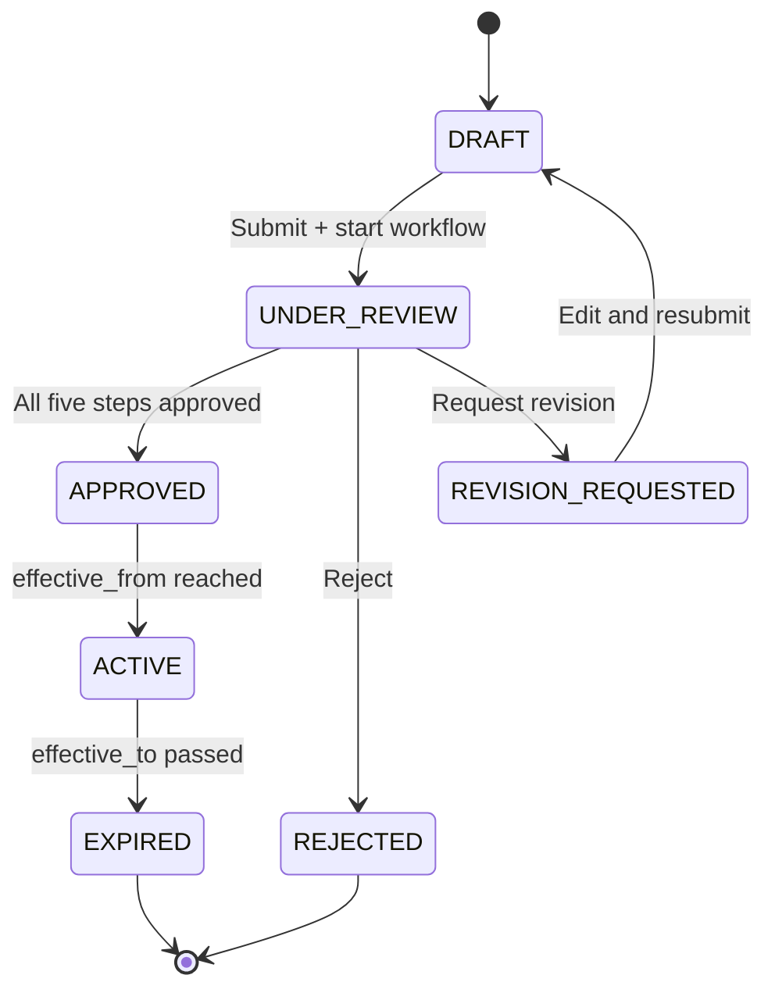
```mermaid
stateDiagram-v2
  [*] --> DRAFT
  DRAFT --> UNDER_REVIEW: Submit + start workflow
  UNDER_REVIEW --> APPROVED: All five steps approved
  UNDER_REVIEW --> REJECTED: Reject
  UNDER_REVIEW --> REVISION_REQUESTED: Request revision
  REVISION_REQUESTED --> DRAFT: Edit and resubmit
  APPROVED --> ACTIVE: effective_from reached
  ACTIVE --> EXPIRED: effective_to passed
  REJECTED --> [*]
  EXPIRED --> [*]
```

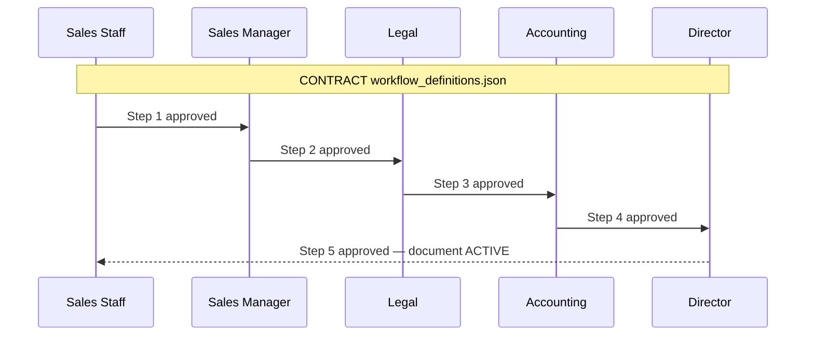
```mermaid
sequenceDiagram
  participant Sale as Sales Staff
  participant Mgr as Sales Manager
  participant Legal as Legal
  participant Acc as Accounting
  participant Dir as Director

  Note over Sale,Dir: CONTRACT workflow_definitions.json
  Sale->>Mgr: Step 1 approved
  Mgr->>Legal: Step 2 approved
  Legal->>Acc: Step 3 approved
  Acc->>Dir: Step 4 approved
  Dir-->>Sale: Step 5 approved — document ACTIVE
```

---

## 5. Communication and consistency model

### 5.1 Synchronous path (business request)

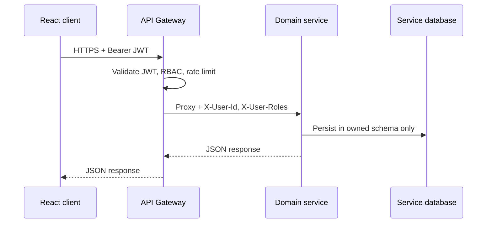
```mermaid
sequenceDiagram
  participant FE as React client
  participant GW as API Gateway
  participant Svc as Domain service
  participant DB as Service database

  FE->>GW: HTTPS + Bearer JWT
  GW->>GW: Validate JWT, RBAC, rate limit
  GW->>Svc: Proxy + X-User-Id, X-User-Roles
  Svc->>DB: Persist in owned schema only
  Svc-->>GW: JSON response
  GW-->>FE: JSON response
```

### 5.2 Asynchronous path (outbox to Kafka)

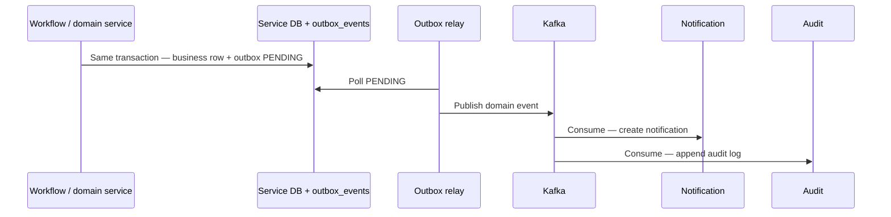
```mermaid
sequenceDiagram
  participant Svc as Workflow / domain service
  participant DB as Service DB + outbox_events
  participant Relay as Outbox relay
  participant K as Kafka
  participant N as Notification
  participant A as Audit

  Svc->>DB: Same transaction — business row + outbox PENDING
  Relay->>DB: Poll PENDING
  Relay->>K: Publish domain event
  K->>N: Consume — create notification
  K->>A: Consume — append audit log
```

**Summary:** request-scoped orchestration is strongly consistent within a service database; notifications and audit are eventually consistent via the transactional outbox.

---

## 6. Operator interface

The React portal follows a dense enterprise (PortOps-inspired) layout with role-based navigation, bilingual copy (English / Vietnamese), and light/dark themes. Screenshots below are taken from the project report.

### 6.1 Authentication (M01)

Centralised login issues a JWT carrying subject and roles. Demo credentials use `password = username` for classroom reproduction.

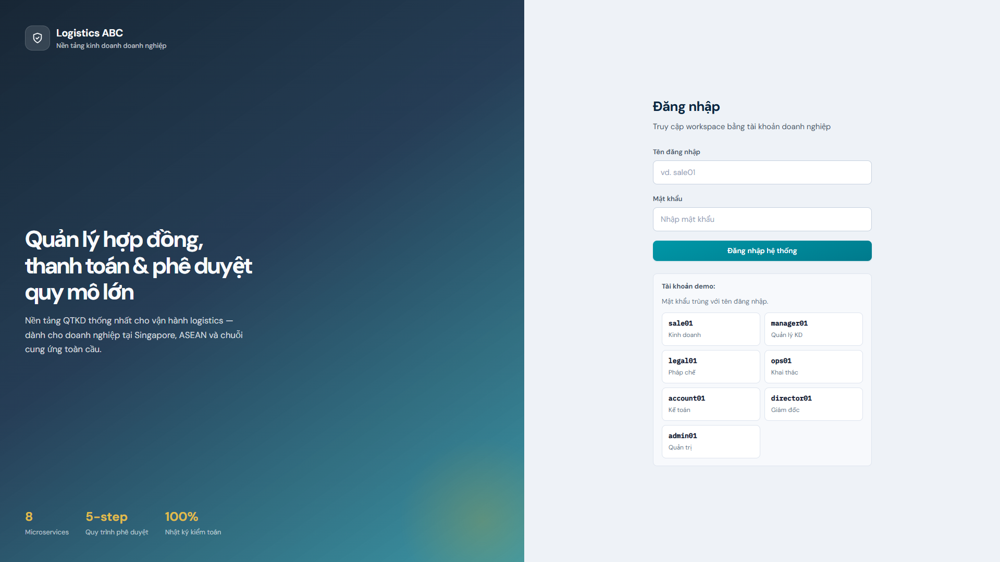

### 6.2 Dashboard (M02)

Role-conditioned control tower: pending approvals, exception counts, draft contracts, expiry warnings within thirty days, and guided end-to-end flow steps.

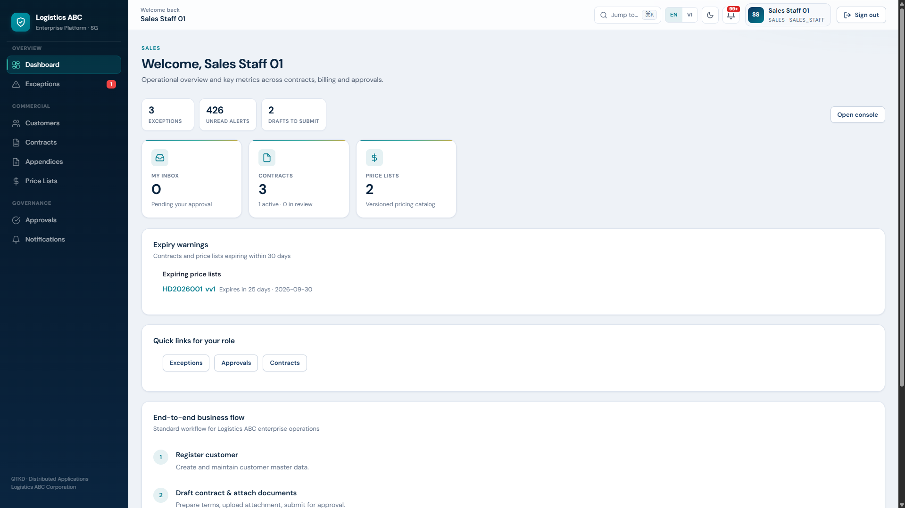

### 6.3 Customers (UC-01 / M03)

Customer master registration, directory search, and suspend actions. Only `ACTIVE` customers may be referenced when submitting contracts.

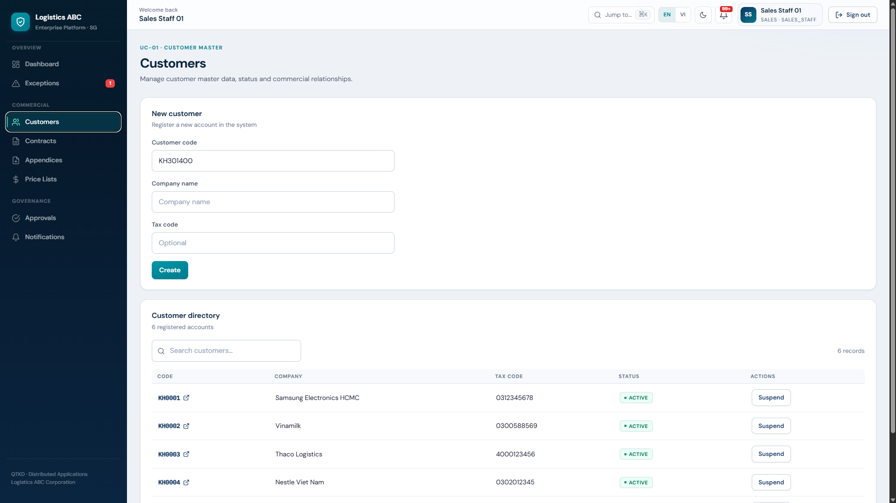

### 6.4 Contracts (UC-02 / M04)

Contract list and detail with lifecycle pipeline (`DRAFT` to `ACTIVE`), mandatory attachments before submit, workflow progress, and entity activity timeline.

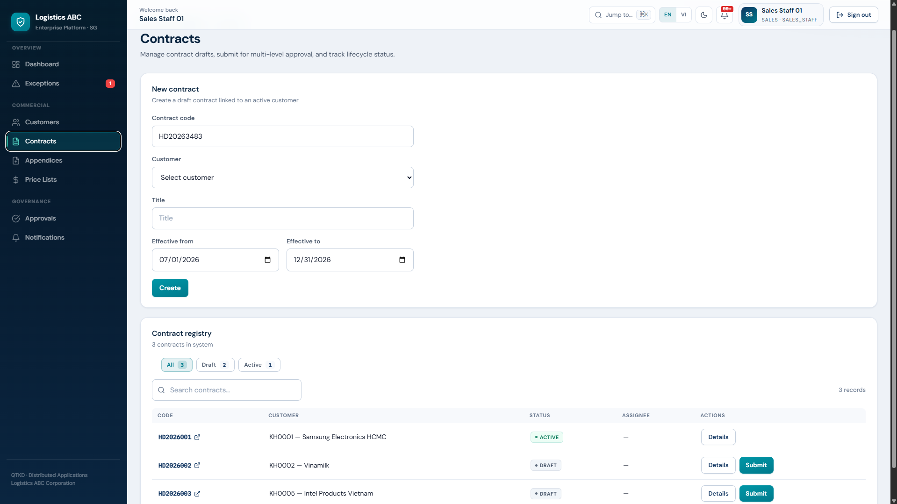

### 6.5 Price lists (UC-04 / M05)

Versioned effective periods, overlap validation, supersede of prior effective lists, and version comparison.

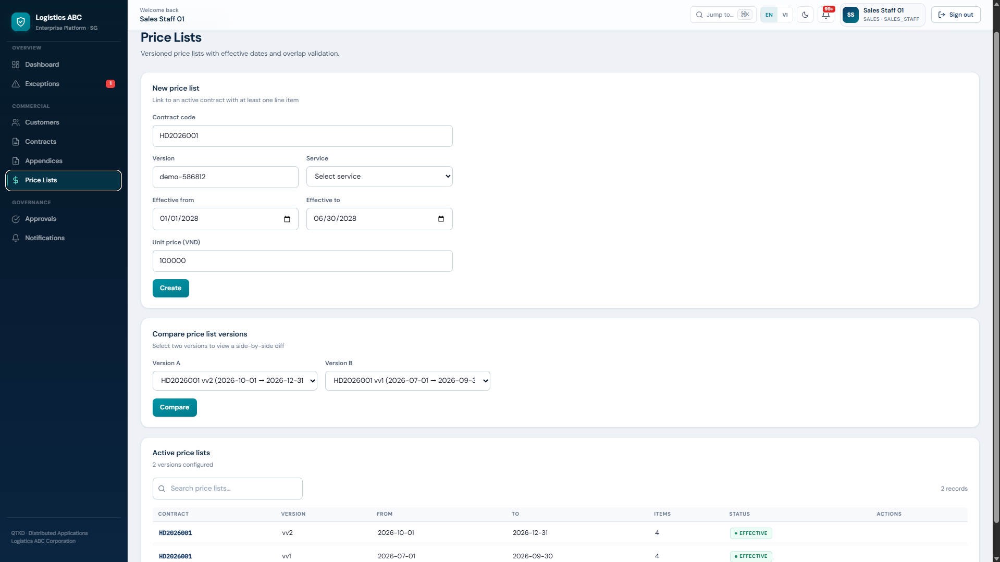

### 6.6 Volumes and periods (UC-05 / M06)

Period states `OPEN` → `RECONCILED` → `LOCKED`. Quantity updates are rejected after lock; locked volumes feed billing generation.

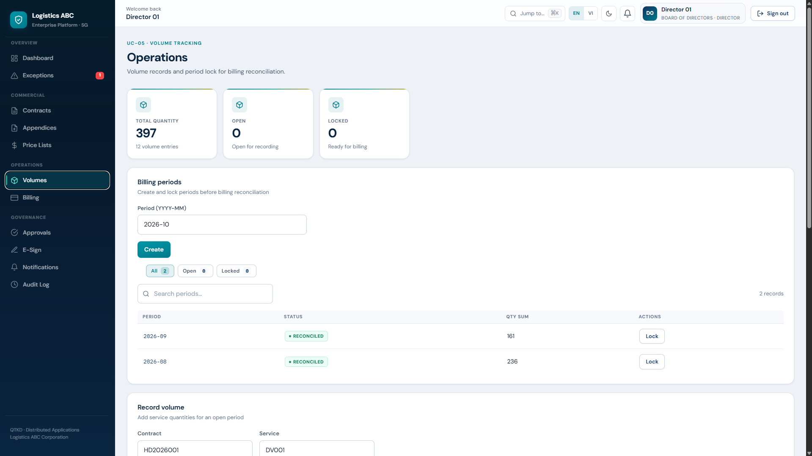

### 6.7 Billing (UC-06 / M07)

Wizard over Draft → Calculate → Reconcile → Submit. Billing aggregates volumes and prices via inter-service REST calls, persists `snapshot_unit_price`, supports statement print/export, and triggers e-sign.

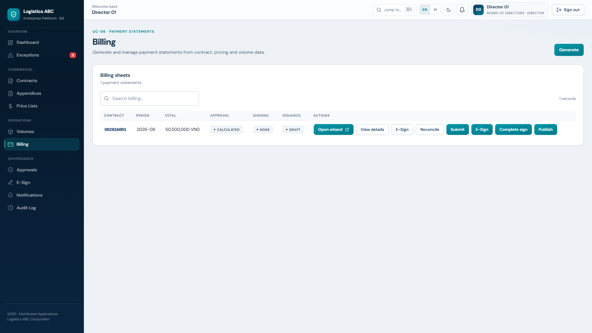

### 6.8 Approval inbox (UC-07 / M08)

Inbox filtered by assignee role and assignee user. Actions: approve, reject, request revision (comment required). Optimistic concurrency uses workflow `version`.

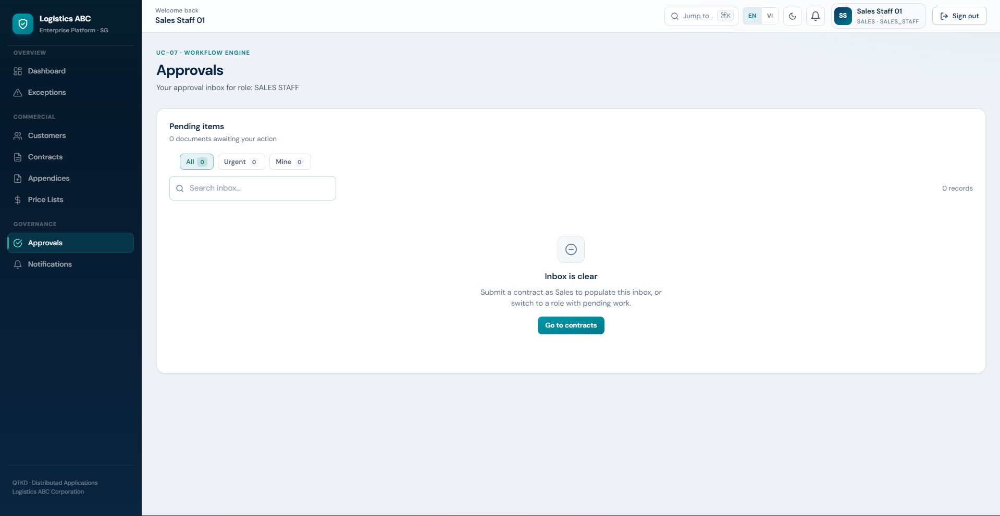

### 6.9 Notifications (UC-09 / M09)

Asynchronous notifications delivered through the outbox–Kafka pipeline; unread indicators and mark-as-read semantics in the portal.

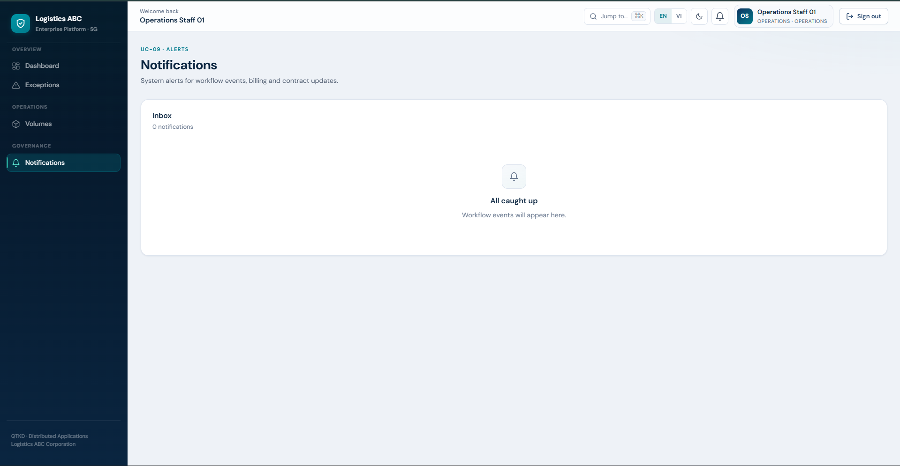

### 6.10 Audit (UC-10 / M10)

Immutable audit query UI for director/admin roles. Scoped entity timelines are available on contract and billing detail views for operational roles.

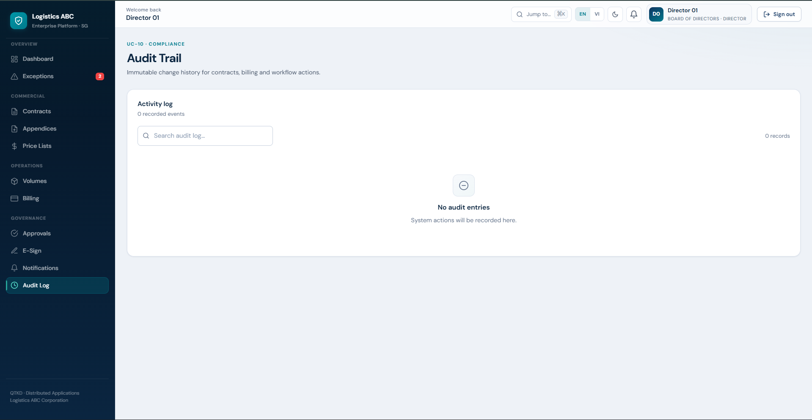

---

## 7. Inter-service interaction patterns

Sequence diagrams from the report summarise collaboration for core use cases.

**UC-01 — Customer management**

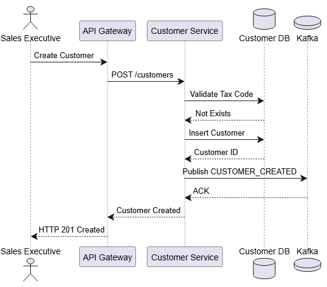

**UC-02 — Contract lifecycle**

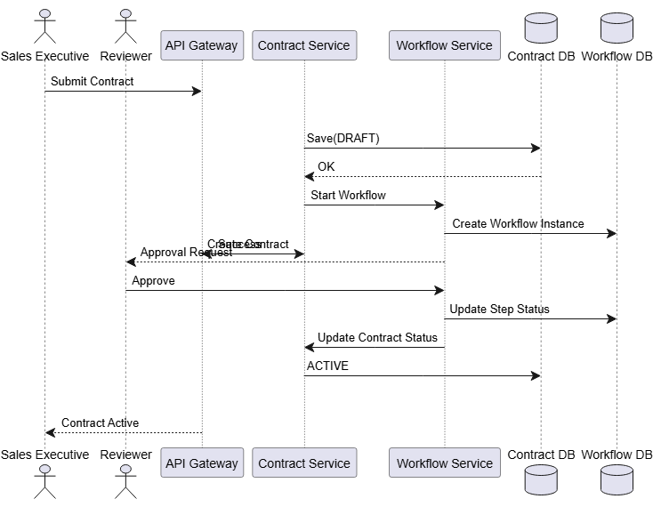

**UC-04 — Price list management**

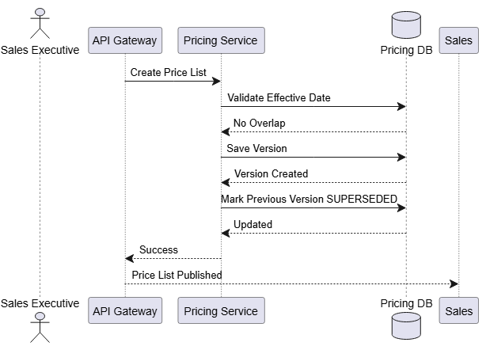

**UC-05 / UC-06 — Billing generation**

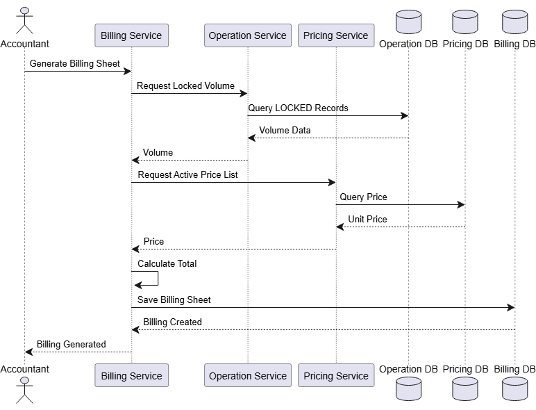

**UC-08 — Asynchronous e-signing**

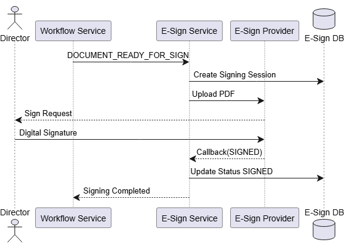

**UC-09 / UC-10 — Notification and audit**

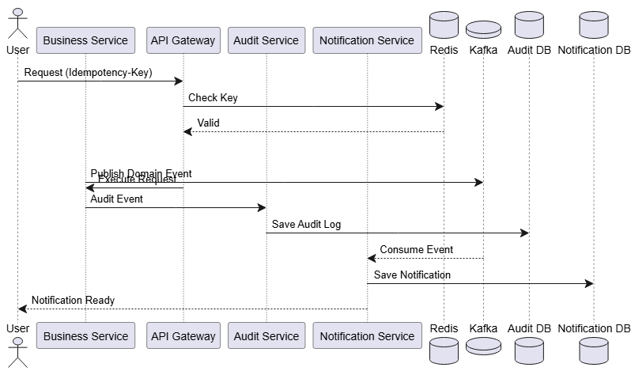

---

## 8. Team structure

Ownership details: [docs/TEAM_ASSIGNMENT.md](docs/TEAM_ASSIGNMENT.md).

| Member | Student ID | Primary ownership |
|--------|------------|-------------------|
| Nguyen The Hien | 22127107 | Lead — API Gateway, Contract Service, shared library, infrastructure, frontend core |
| Bui Le Khoi | 22127205 | Lead — Billing Service, Workflow Service, billing and approvals UI |
| Le Quang Tan | 22127378 | Pricing, Operation, Notification, E-Sign services and related UI |
| Nguyen Minh Hieu | 21127742 | Audit Service and audit administration UI |

---

## 9. Reproduction

### Prerequisites

Docker Desktop. Optional: Node.js 20+, Python 3.11+.

### Run the stack

```bash
git clone https://github.com/TheHien04/Enterprise-Management-System---DISTRIBUTED-APPLICATIONS.git
cd Enterprise-Management-System---DISTRIBUTED-APPLICATIONS
cp .env.example .env
make up
```

Allow approximately 30–60 seconds for PostgreSQL and Kafka readiness probes.

| Endpoint | Purpose |
|----------|---------|
| http://localhost:5173 | Operator portal |
| http://localhost:8080/docs | API Gateway OpenAPI |
| http://localhost:8001/docs | Contract Service OpenAPI |

Stop containers without deleting volumes: `make down`.

### Demo accounts

Password equals username for all accounts.

| Username | Role | Typical surfaces |
|----------|------|------------------|
| `sale01` | SALES_STAFF | Customers, contracts, pricing, approvals |
| `sale02` | SALES_STAFF | Same role; used to demonstrate assignee-user denial |
| `manager01` | SALES_MANAGER | Manager approval step |
| `legal01` | LEGAL | Legal review |
| `ops01` | OPERATIONS | Volumes and periods |
| `account01` | ACCOUNTING | Billing, e-sign, accounting approval |
| `director01` | DIRECTOR | Final approval and audit |
| `admin01` | ADMIN | Full access and admin console |

Authorisation is enforced in the UI (`frontend/src/config/rbac.ts`) and again at the gateway (`SERVICE_ROLE_REQUIREMENTS`).

### Suggested walkthrough

1. Sign in as `sale01` — dashboard, exceptions, contract submit.  
2. Sign in as `manager01` / `legal01` — approval inbox.  
3. Sign in as `ops01` — lock volumes; as `account01` — generate billing.  
4. Sign in as `director01` — audit log.  

---

## 10. Evaluation scenarios

With the stack running:

```bash
pip install -e ".[test]"
pytest backend/tests -v
```

Integration cases SC-01 through SC-10 live in `backend/tests/integration/test_scenarios.py`, with seed data in `config/seed_data.json`.

---

## 11. References

| Document | Description |
|----------|-------------|
| [docs/UDPT-09-Report.pdf](docs/UDPT-09-Report.pdf) | Formal project report |
| [docs/ARCHITECTURE.md](docs/ARCHITECTURE.md) | Design principles and request flow |
| [docs/SERVICE_MAP.md](docs/SERVICE_MAP.md) | Use case to folder and API mapping |
| [docs/TEAM_ASSIGNMENT.md](docs/TEAM_ASSIGNMENT.md) | Module ownership |
| [docs/QTKD_DATH.pdf](docs/QTKD_DATH.pdf) | Assignment specification |
| [docs/UDPT.pdf](docs/UDPT.pdf) | Course material |
| [docs/Data sample.pdf](docs/Data%20sample.pdf) | Sample commercial data |
| [config/state_machines.json](config/state_machines.json) | Entity state machines |
| [config/workflow_definitions.json](config/workflow_definitions.json) | Approval workflow templates |

---

Logistics ABC Corporation · Distributed Applications (UDPT) · Academic demonstration, 2026
