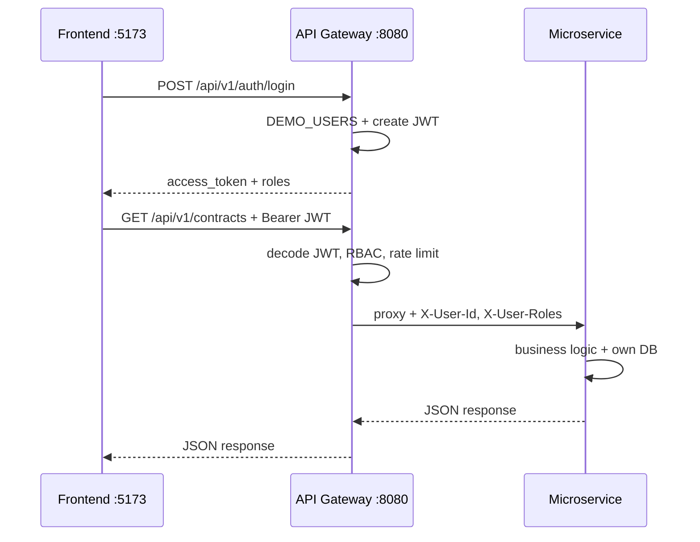
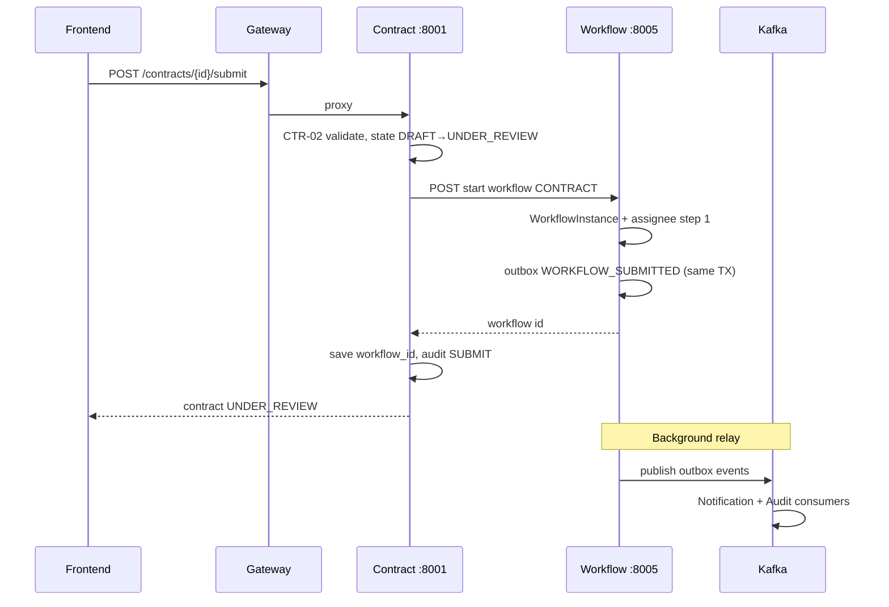
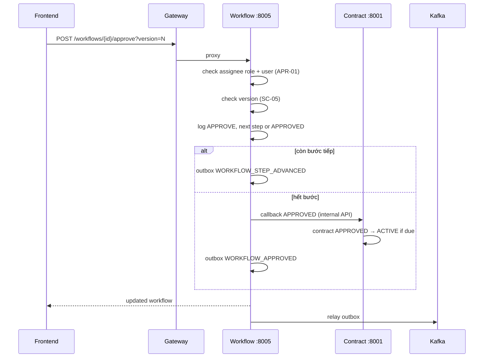
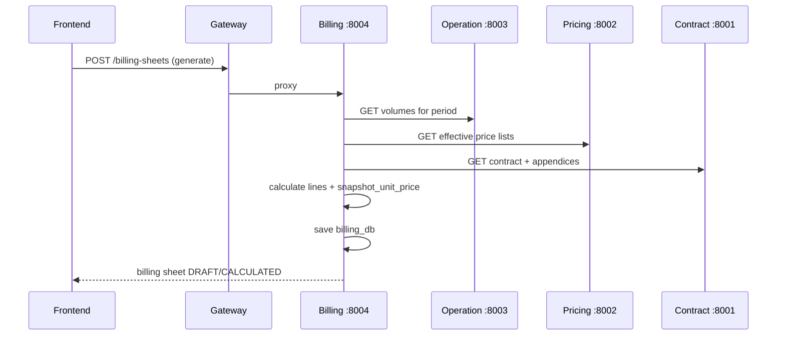
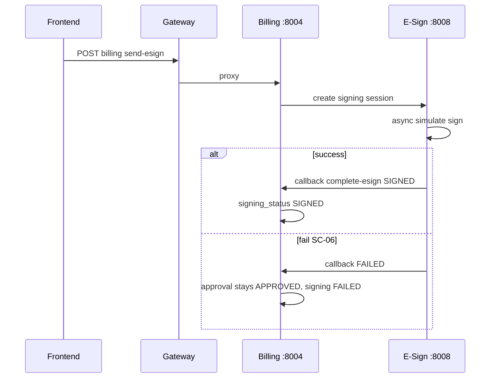
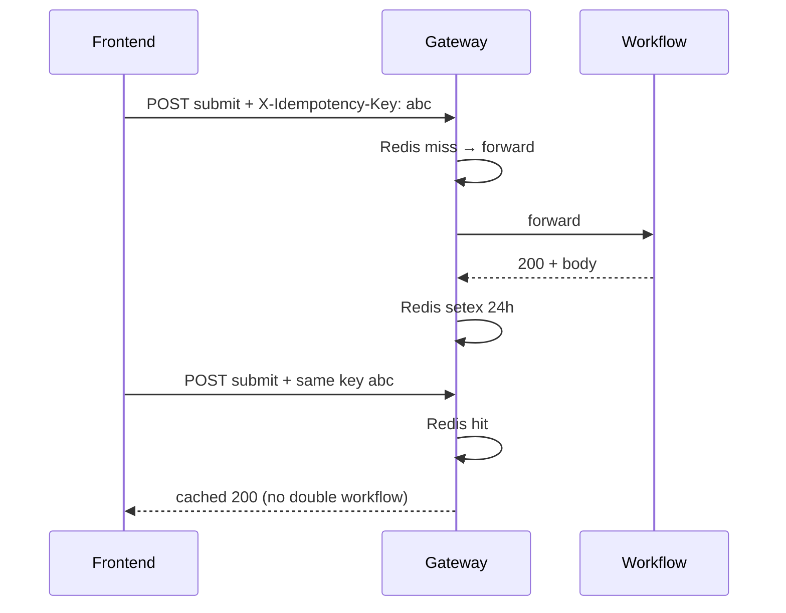
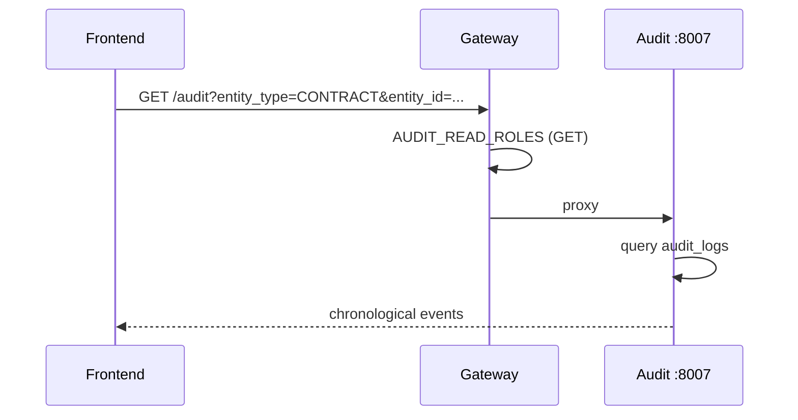

# Luồng xử lý chi tiết (Request Flows)

Sequence diagram và mô tả từng bước — dùng khi vẽ slide hoặc trả lời "luồng chạy thế nào".

---

## 1. Login & request qua Gateway

**Header gateway gửi xuống service:** `X-User-Id`, `X-User-Roles`, (tuỳ chọn) `X-Idempotency-Key`.

---

## 2. Submit hợp đồng + start workflow

**File chính:**  
- `customer_service.py` → `submit_contract`  
- `workflow_engine.py` → `start`  
- `outbox.py` → `enqueue_domain_event`

---

## 3. Approve workflow (một bước)

**Reject / Request revision:** callback `REJECTED` / `REVISION_REQUESTED` tương tự; reject bắt buộc comment APR-03.

---

## 4. Tạo billing sheet

**Rules:** PAY-01→07; SC-04 snapshot; SC-03 contract expired; SC-10 appendix effective date.

---

## 5. E-sign async

Retry: `send-esign` từ FAILED → PENDING_SEND (PAY-07).

---

## 6. Idempotency (SC-09)

Gateway: `backend/gateway/app/main.py` lines ~130–173.  
Workflow: `idempotency_key` column duplicate check.

---

## 7. Audit timeline (Activity panel)

Events được ghi qua: `log_audit()` HTTP và/hoặc Kafka consumer từ domain events.

---

## 8. Expiry scheduler (contract-service)

Background task (~5 phút):

- `APPROVED` + `effective_from <= today` → `ACTIVE`
- `ACTIVE` + `effective_to < today` → `EXPIRED`
- Price lists nearing expiry → feed Exceptions UI (via API list + frontend aggregate)

File: `backend/services/contract-service/app/services/expiry_service.py`

---

## Liên kết

| Tài liệu | Nội dung |
|----------|----------|
| [ARCHITECTURE.md](./ARCHITECTURE.md) | Nguyên tắc thiết kế |
| [SERVICE_MAP.md](./SERVICE_MAP.md) | UC → folder |
| [DEMO.md](./DEMO.md) | Script trình bày |
| [DEFENSE_GUIDE.md](./DEFENSE_GUIDE.md) | Q&A vấn đáp |
